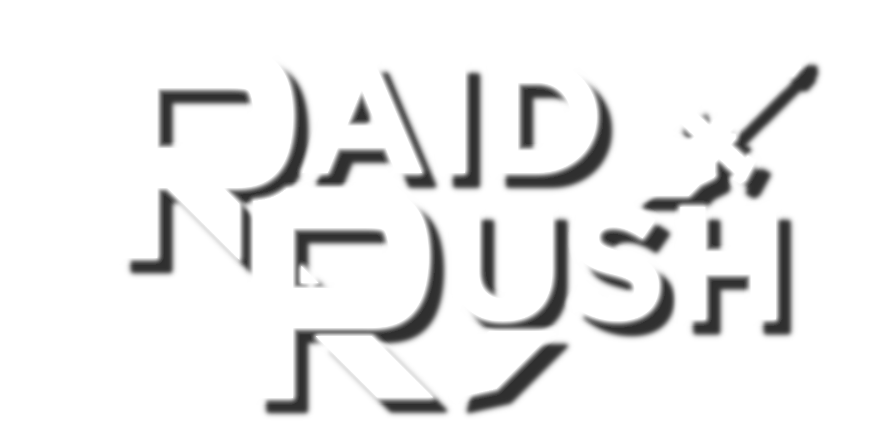
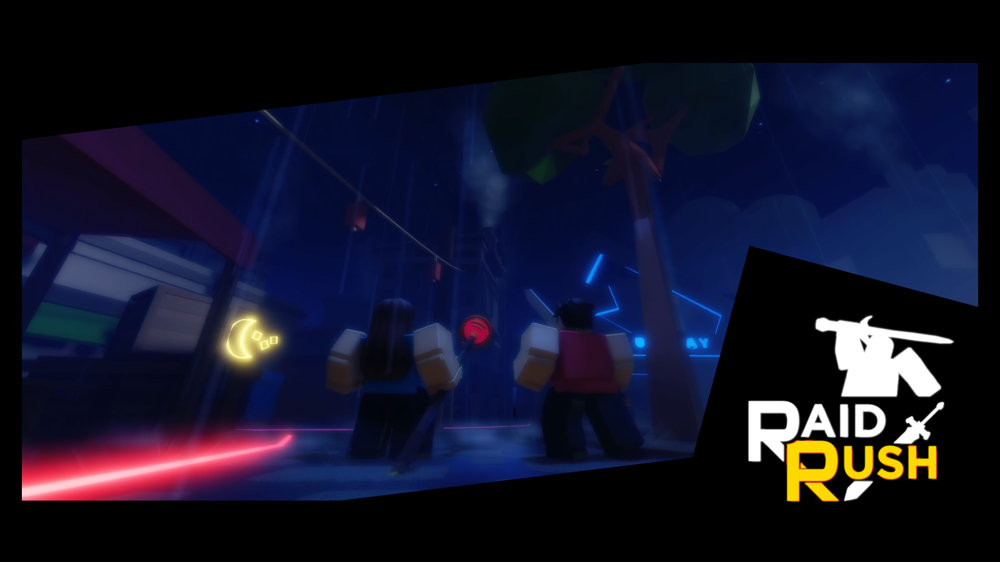

<h1 align="center">
   
  
   
  RAID RUSH!
   
</h1>

<h3 align="center">A co-op boss-fighting game on the <a href="http://roblox.com" target="_blank">Roblox</a> platform.</h3>

<h4 align="center">Click on the picture to watch the trailer!</h4>

## Preface
Raid Rush is a co-op boss-fighting game on Roblox where you and up to seven other players team up to hunt down powerful bosses across different realms. You get flashy abilities, magic, and cool effects to take down massive enemies.

The gameplay loop is all about grinding: defeat bosses, earn resources and loot, and use them to get stronger for the next round! There's a passive progression system, so even when you're losing, you're still getting progress!
- Over 13 unique boss fights that users can fight against. These bosses will scale based on player skill, and each boss has their own strengths and weaknesses, allowing groups to form strategies and beat them in no time.
- Over 70 completely unique weapons, 70 unique abilities, and 30 enchantments! The possibilities are (almost) endless! 
- Players are able to customize their weapon by putting on any ability and enchantment on their weapon, allowing for potentially insane weapon builds! 

### How well did this project perform?
Viewing the analytics provided by the Roblox Creator Dashboard, at its peak Raid Rush has achieved:
- **3.5 million** unique impressions, **250,000** unique players, over **100,000** monthly active users, and over **5,000** daily active players!
- Achieved the top 1000 most earning experiences milestone on the Roblox platform!
- Achieved the top 100 best paid experiences on the Roblox platform for the Winter 2023 term!

### How did this all start off?
I wanted to see a boss-fighting game where the boss scaled based on how experienced players were, and I made it, and here we are.

